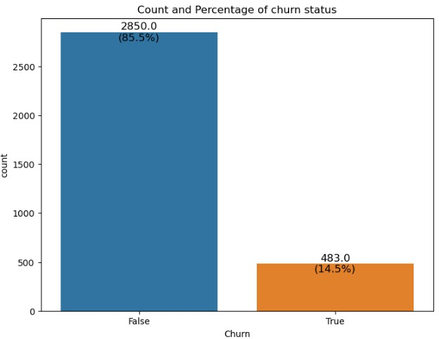
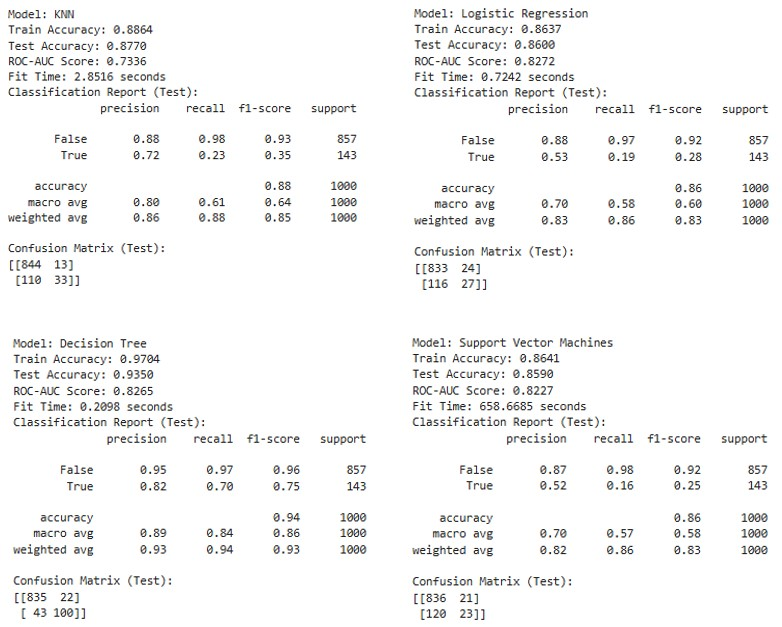
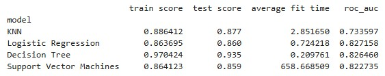
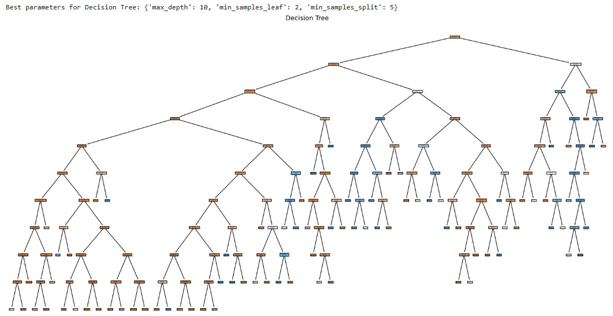
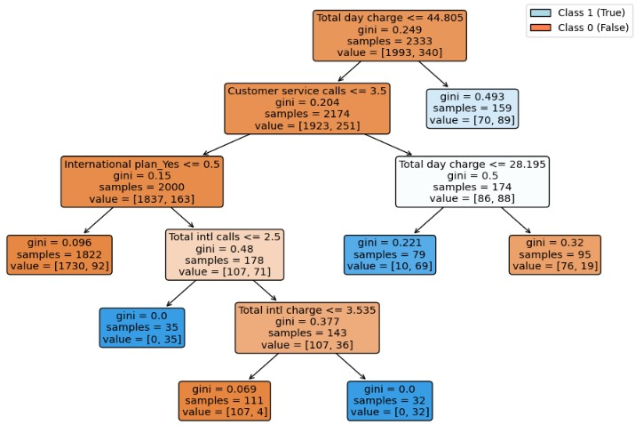
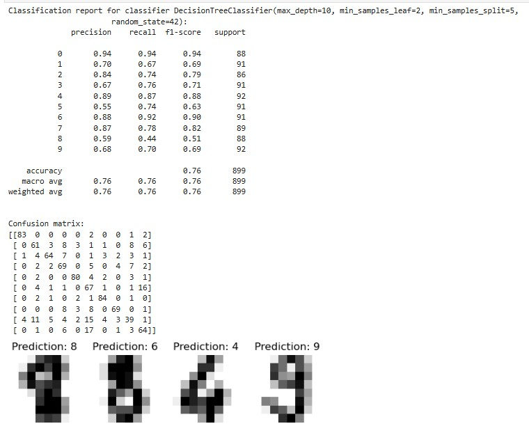
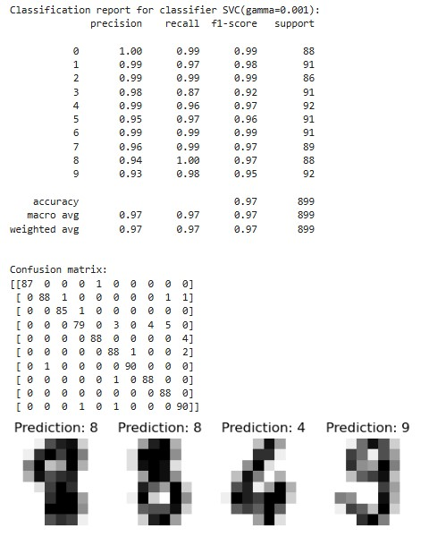

# Comparative analysis of different machine learning classification models used for predicting Customer Churn

***Introduction*** 
Predicting customer churn, when someone chooses to stop using your products or services, is a critical task for businesses aiming to retain their customer base and optimize their marketing strategies. The effectiveness of machine learning models in predicting customer churn can significantly impact business outcomes. This study aimed to compare four prominent classification models—Logistic Regression, Decision Trees, K-Nearest Neighbors (KNN), and Support Vector Machines (SVM)—to determine the most suitable model for predicting telecom customer churn, considering factors such as handling imbalanced classes, training speed, and interpretability.

***Objectives***
* Evaluate the suitability of Logistic Regression, Decision Trees, KNN, and SVM for predicting customer churn in terms of weaknesses and strengths.
* Compare the models in terms of accuracy, training speed/time, and ROC-AUC score to determine the best-performing model for predicting customer churn.

***Models Analyzed***

* ***Logistic Regression*** 
    ***Pros:*** Easier interpretability, fast to train and can handle imbalanced classes. 
    ***Cons:*** May struggle with capturing complex, non-linear patterns without feature engineering or polynomial terms. 

* ***Decision Trees*** 
    ***Pros:*** Models are easy to visualize and interpret, tree can be pruned to improve performance on minority classes, and fast to train. 
    ***Cons:*** Trees can become overly complex and overfit the training data.
    
* ***K-Nearest Neighbors (KNN)*** 
    ***Pros:*** Simple and easy to implement and can perform well with imbalanced classes if combined with appropriate distance metrics and weighting schemes. 
    ***Cons:*** Slow at prediction time, especially with large datasets and less interpretable compared to other models.

* ***Support Vector Machines (SVM)*** 
    ***Pros:*** Effective in high-dimensional spaces, can handle class imbalance with appropriate kernel functions and hyperparameters and often performs well in complex and non-linear classification tasks. 
    ***Cons:*** Can be slow and computationally expensive with large datasets and harder to interpret due to the use of kernels and the high-dimensional space transformation. 

***Methodology***
* ***Data Preparation:*** telecom_churn.csv dataset was used for the study.  
* ***Feature and Target Variables:*** The dataset was split into features (X) and target labels (y). Furthermore, it was split into training and test sets using python's *train_test_split* function. 

     The target variable was *Churn* while the features below where used in the analysis. 

      ['Account length', 'Area code', 'Number vmail messages', 'Total day minutes', 'Total day calls', 'Total day charge', 'Total eve minutes', 'Total eve calls', 'Total eve charge', 'Total night minutes', 'Total night calls', 'Total night charge', 'Total intl minutes', 'Total intl calls', 'Total intl charge', 'Customer service calls', 'International plan_Yes', 'Voice mail plan_Yes']  

    The variable *State* was dropped in order to retain *Area_code* that provided more information about location. Categorical variables *International plan* and *Voice mail plan* were encoded to create dummy variables. The dataset was checked for missing values and duplicates.

* ***Hyperparameter tuning:*** The parameter grids below were explored for each respective model:  
    ***KNN:*** n_neighbors values of 3, 5, and 7. 
    ***Logistic Regression:*** C values of 0.1, 1, and 10. 
    ***Decision Tree:*** max_depth values of None, 10, and 20; min_samples_split values of 2 and 5; and min_samples_leaf values of 1 and 2. 
    ***SVM:*** C values of 0.1, 1, and 10, and kernel types 'linear' and 'rbf'. 

    GridSearchCV was performed to exhaustively search over the specified hyperparameter grids with 5-fold cross-validation (cv=5). GridSearchCV is a powerful machine learning tool used for hyperparameter optimization. It performs an exhaustive search over a specified hyperparameter grid to find the best combination of hyperparameters that optimize performance for a given model.
  
* ***Model Training and Evaluation:*** 
    Time taken to fit each model (training duration) was measured using Python's *time.time()* function. 
    ***Predictions and Performance Metrics:*** 
       Predictions for both training and test sets were calculated. 
    ***Accuracy Scores:*** Accuracy for both training and test datasets were computed using Python's *accuracy_score* function. 
    ***Classification Report:*** Detailed classification reports for the test sets, including precision, recall, and F1-score were output. 
    ***Confusion Matrix:*** Confusion matrices to visualize model performance were computed. 
    ***ROC-AUC Score:*** The ROC-AUC score for test predictions were computed to evaluate model performance on imbalanced classes. 

***Results:*** 
From the data it was observed that 14.5% of the customers churned while 85.5% did not, depicting imbalanced classes.

***Comparative analysis*** 
* ***Train Score:*** The Decision Tree had the highest training score, indicating that it fit the training data exceptionally well. However, very high train scores can sometimes indicate overfitting, particularly if the test score is significantly lower. KNN, SVM and Logistic Regression had comparable train scores, with KNN performing slightly better.

* ***Test Score:*** The Decision Tree also had the highest test score, suggesting it generalized well to unseen data compared to the other models.
KNN performed better than Logistic Regression and SVM on the test data, though the differences were smaller.

* ***Average Fit Time:*** The Decision Tree was the fastest to train, followed by Logistic Regression and KNN. SVM had an extremely long training time, which may be impractical for large datasets or real-time applications.

* ***ROC-AUC Score:*** Logistic Regression had the highest ROC-AUC score, indicating it was the most effective at distinguishing between churn and non-churn classes. The Decision Tree's ROC-AUC score was almost as high as Logistic Regression, while KNN and SVM performed slightly worse.

***Trade-offs and Suitability***
* ***Interpretability:*** Logistic Regression and Decision Trees offer high interpretability. Logistic Regression provides coefficients (or odds ratios) that are easy to understand, while Decision Trees offer clear rules that can be visualized. KNN and SVM are less interpretable. KNN doesn’t provide straightforward rules, and SVM’s decision boundary can be complex to interpret, especially with non-linear kernels.

* ***Handling Imbalanced Classes:*** Logistic Regression and SVM are typically better at handling imbalanced classes due to their probabilistic nature and regularization options. KNN might struggle with class imbalance if not appropriately tuned. Decision Trees can handle imbalanced classes reasonably well but might require additional adjustments like pruning or ensemble methods for optimal performance.

* ***Training Time:*** Decision Trees and Logistic Regression are quick to train, making them suitable for scenarios where training time is a critical factor.
  
***Conclusion*** 
This analysis provided a comprehensive comparison of Logistic Regression, Decision Trees, KNN, and SVM in the context of predicting customer churn. By examining how each model handled imbalanced classes, training speed, and interpretability, Decision Trees best met the needs of this classification task.

***A Decision Tree Predicting Customer Churn:***

***An overfit Tree***

***A pruned Tree***

Cost Complexity Pruning (CCP) or Weakest Link Pruning, a technique used in decision tree algorithms to prevent overfitting and enhance generalization was used.

***Interpretation:***

A decision tree uses a top-down approach, known as recursive binary splitting, to partition the feature space into distinct and non-overlapping regions or subgroups. The process involves making splits at each node based on features that best separate the target variable. This recursive partitioning continues until a stopping criterion is met, resulting in leaf nodes where data points either belong to the same class or achieve maximum purity. Measures like the Gini index or cross-entropy are used to evaluate node purity.

In our study, the decision tree uses the features; *Total day charge, Customer service calls, International plan_Yes, Total intl calls* and *Total intl charge* to predict customer churn:

Below is a summary of the decision rules used by our tree:

***Predict True (churn)*** 
    1.	If Total day charge is more than 44.81. 
    2.	If Total day charge is 44.81 or less; Customer service calls is 3.50 or fewer; the customer has an international plan and Total intl calls is 2.50 or fewer. 
    3.	If Total day charge is 44.81 or less; Customer service calls is 3.50 or fewer; the customer has an international plan; Total intl calls is more than 2.50 and Total intl charge is more than 3.53. 
    4.	If Total day charge is 44.81 or less; Customer service calls is more than 3.50 and Total day charge is 28.20 or less. 

***Predict False (no churn)*** 
    1.	If Total day charge is 44.81 or less; Customer service calls is 3.50 or fewer; the customer has an international plan; Total intl calls is more than 2.50 and Total intl charge is 3.53 or less. 
    2.	If Total day charge is 44.81 or less; Customer service calls is 3.50 or fewer; the customer does not have an international plan. 
    3.	If Total day charge is 44.81 or less; Customer service calls is more than 3.50 and Total day charge is more than 28.20. 

***Summary*** 
This decision tree provides a clear set of rules based on key features to classify customers as likely to churn or not. By understanding these rules, you can gain insights into which factors are most influential in predicting customer churn, allowing for targeted interventions and strategies.

***Other uses of Machine Learning Classifiers:*** Case of Recognizing Handwritten Digits.  
Two models, a decision tree classier and Support Vector Machine/Classifier (SVC)  were trained on handwritten digit data provided.

Load the digits dataset
digits, labels = load_digits(return_X_y=True)
digits
array([[ 0.,  0.,  5., ...,  0.,  0.,  0.],
       [ 0.,  0.,  0., ..., 10.,  0.,  0.],
       [ 0.,  0.,  0., ..., 16.,  9.,  0.],
       ...,
       [ 0.,  0.,  1., ...,  6.,  0.,  0.],
       [ 0.,  0.,  2., ..., 12.,  0.,  0.],
       [ 0.,  0., 10., ..., 12.,  1.,  0.]])

Below are the Classification reports for the two classifiers:

Decision Tree

Support Vector Machine

***Recommended Classifier*** 
For recognizing handwritten digits in our study, SVC was the most suitable classifier because of its higher accuracy (0.97) compared to Decision Tree classifier (0.76). Furthermore, SVC offers High-Dimensionality typical in image recognition tasks, and Kernel Trick to handle non-linear data. However, even if SVC is most suitable in this case, the choice of classifier may depend on the specific requirements of the application, including the trade-off between accuracy, interpretability, and computational efficiency.

